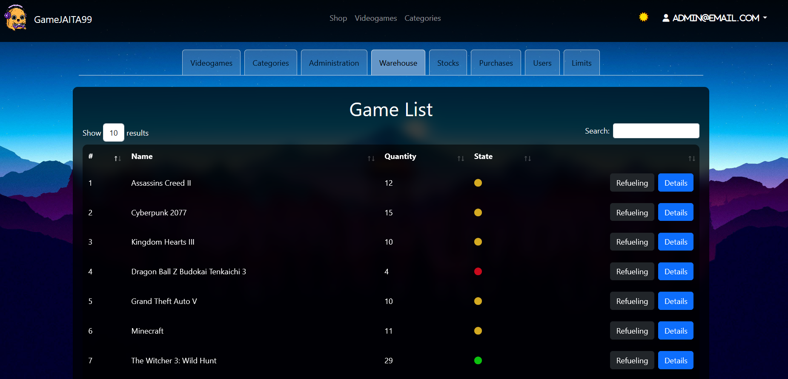

# Video game shop

- [Video game shop](#video-game-shop)
  - [Project Description](#project-description)
  - [Project overview](#project-overview)
    - [ER-Diagram](#er-diagram)
    - [Homa page](#homa-page)
    - [Registration](#registration)
    - [User profile](#user-profile)
    - [Administration](#administration)
    - [Warehouse](#warehouse)
  - [Credits](#credits)

## Project Description

The goal of the project was to develop an e-commerce platform for video games, applying the theoretical skills acquired during the 3-month course.

The basic requirements included implementing CRUD operations for essential entities and consequently creating a suitable user-administrator interface.

We then enhanced the project by implementing a (trivial) security module and integrating graphs.

## Project overview

### ER-Diagram

### Homa page

### Registration

### User profile

### Administration

### Warehouse

## Credits

